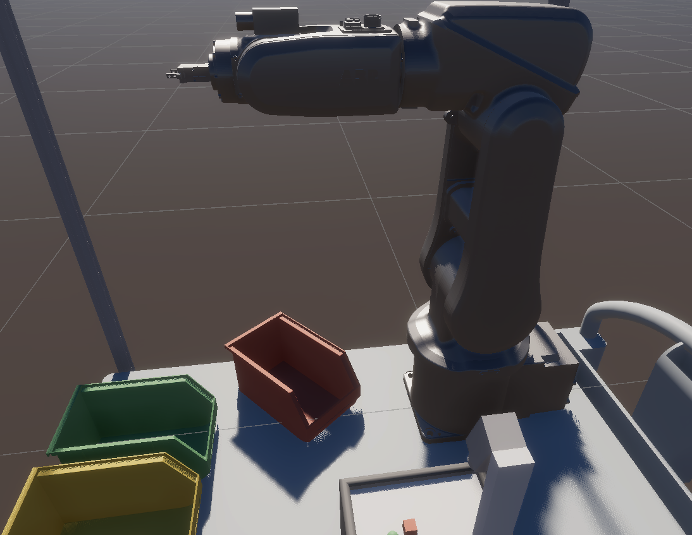
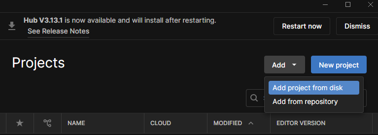

## ABB Robot Unity Simulation

### Overview

This repository provides source code and assets for simulating the ABB IRB 120
robot via Unity. At just 25 kg, the ABB IRB 120 is the smallest robot available
in the ABB lineup. We utilize the URDF of the robot and demonstrate the task of
pick and place using search space constrained RRT path planning. The robot is
also able to track an object, which can be controlled by spacemouse inputs.

### System Requirements

This simulation has the following software requirements:

- [Unity](https://unity.com/download)
- [3Dconnexion SpaceMouse SDK](https://3dconnexion.com/tw/service/)

### Installation

After installing the required software, clone the repository:

    $ git clone https://github.com/robotic-vision-lab/ABB-Robot-Unity-Simulation.git

Then, open Unity Hub and click "Add project from disk." Lastly, select the
"ABB-Robot-Unity-Simulation" folder that was just cloned.

### Scenes

In the Assets/Scenes folder, there are two scenes: BinPicking and
SpaceMouseTest.

### Bin Picking

The robot can perform a bin picking task in the BinPicking scene. To enable
simulation, execute the following steps:

1. While in Play Mode, click on "abb_new" in the Hierarchy tab on the left.
2. In the Inspector window, clicking the "Next Target" button will highlight a
green path to the target.
3. Clicking "Next Point" will move the end effector along the interop points of
the path until it reaches the target. The robot will return to its neutral
state with the target. Note: clicking "Next Point" again will move the robot
and target along the path.
4. Clicking "Place" will place the object in a bin. 
5. Clicking "Next Target" will create another path to a new target.

### Spacemouse Test

The robot will track the "spacemouse_test" (which can be controlled using a
SpaceMouse) object in this scene. In the Inspector tab of the
"spacemouse_test" object, the rotation and translation speed can be controlled.

### Open Problems 

The current simulation has the following issues: 

1. The logic of the pick-and-place buttons is not fully fleshed out. 
2. The inverse kinematics can sometimes cause the joints to rotate outside of
the expected range.
