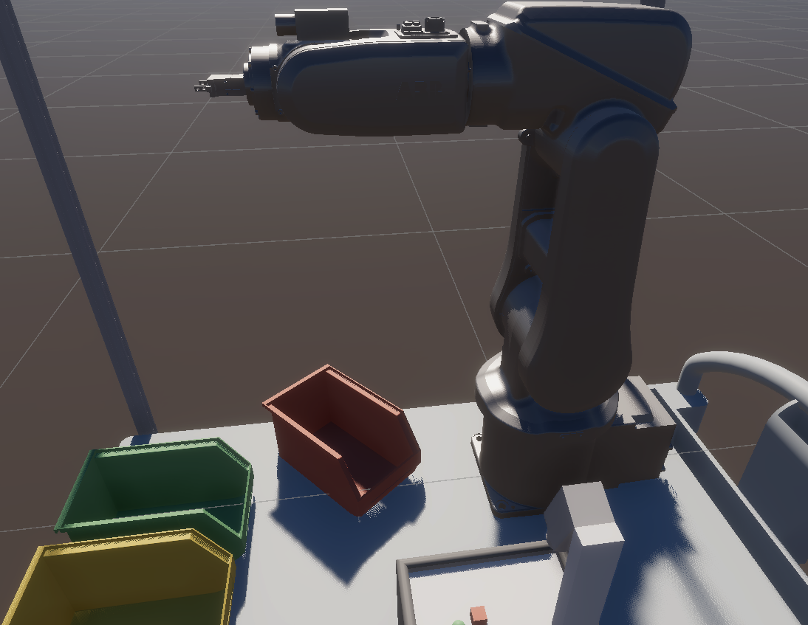
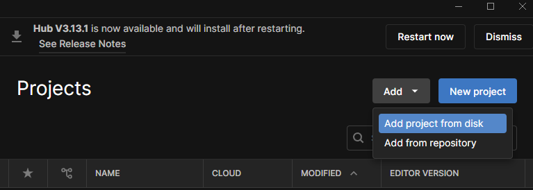

# ABB120 Simulation

This repository uses the URDF of the ABBIRB120 robot arm for pick and place task using search space constrained RRT path planning. The robot is also able to track an object which can be controlled w/ SpaceMouse inputs.



## Requirements

1. [SpaceMouse SDK](https://3dconnexion.com/tw/service/)
2. [Unity](https://unity.com/download)

## Installation

1.  Clone the repo
    ```sh
    git clone https://github.com/robotic-vision-lab/ABB120.git
    ```

2. Open Unity Hub and click "Add project from disk". Select the "ABB120" folder that was just cloned.



## Scenes

In the Assets/Scenes folder, there are two scenes: BinPicking and SpaceMouseTest

### Bin Picking

The robot performs the pick and place task in this scene:

1. While in Play Mode, click on "abb_new" in the Hierarchy tab on the left.
2. In the Inspector window, clicking the "Next Target" button will highlight a green path to the target.
3. Clicking "Next Point" will move the end effector along the interop points of the path until it reaches the target. The robot will return to its neutral state with the target (Note: clicking "Next Point" again will move bot the robot and target along the path).
4. Clicking "Place" will place the object in a bin. 
5. Clicking "Next Target" will create another path to a new target.

### SpaceMouseTest

The robot will track the "spacemouse_test" (which can be controlled using a SpaceMouse) object in this scene.

In the Inspector tab of the "spacemouse_test" object, the rotation and translation speed can be controlled

## Current Problems

1. The logic of the pick and place buttons is not fully fleshed out
2. The IK can sometimes cause the joints to rotate outside of the expected range